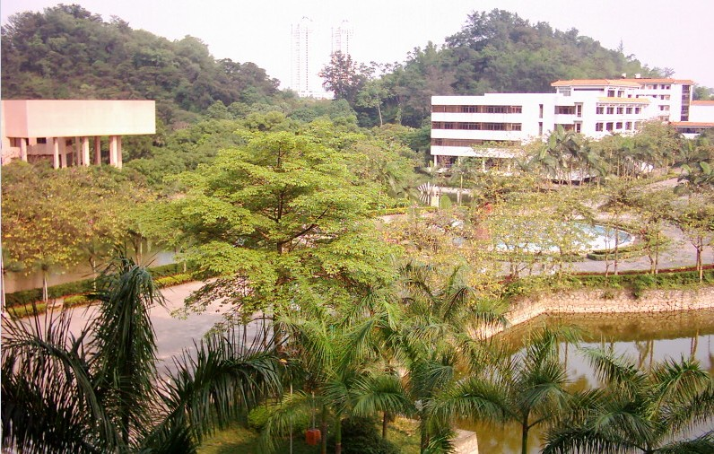

#暑假的实习

###2014/05/16

今天刚收到的消息，<http://dept.wyu.cn/jsj/List.asp?id=1638>我们暑假要在学校培训和实习，培训一个月，实习半年(好吧，不能回家了)。刚听到这个消息的时候还不觉得有多坑，可是一进去看了详情之后，顿觉得这是要把我们全卖了的节奏啊，先不说他的课程安排怎样了，我就不吐槽了，大家自己看课程安排吧！
>第1�A段培�������⒃�2014年7月14日�_始，�槠�4周，���r有PHP���X�Z言、商�I分析�蟊怼�Android��件�_�l，iOS��件�_�l，HTML5�_�l流程等�n程。
>第2�A段���`�����⒃�2014年8月11日�_始，�槠�6��月，此����是第1�A段所�W的知�R和���H����的相�Y合，是�W生的知�R�M一步��固的�^程。
好吧，敢情一个月我们就成神了，一个课程就几天的课先不说，就是那个实践训练也是够坑到家的了吧！你妹的，说好的实习呢？怎么成在学校实验室了呢？还要我们在那待上6个月，如果是让我们去公司实习我想我们会更有动力的。言尽于此，希望学校安排的这个暑假实习不会像我想象中那么坑吧！顺便给自己打打气，下周六的软考，好好备考吧！

